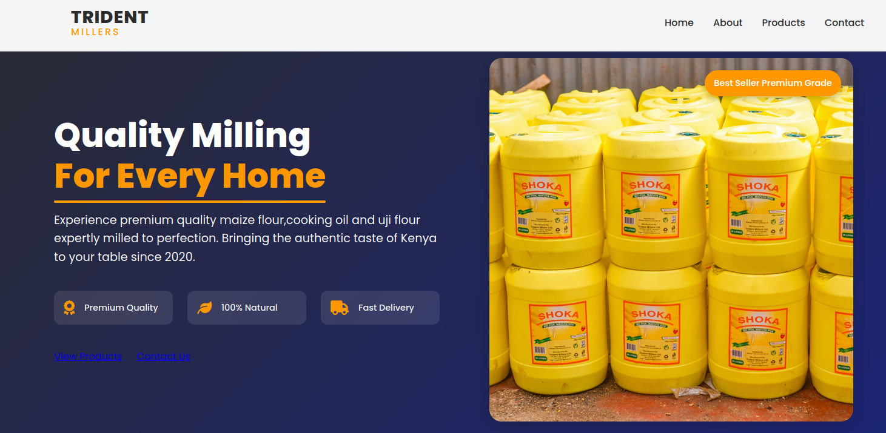

# Shoka Milling Company Website

## Description
This project is a responsive website for Shoka Milling Company, showcasing their premium quality maize flour, cooking oil, and uji flour products. The website is designed to highlight the company's commitment to quality, natural ingredients, and efficient delivery.

## Features
- Responsive design for optimal viewing on all device sizes
- Hero section with key product features and call-to-action buttons
- Product showcase section
- About Us section detailing the company's history and values
- Contact form for customer inquiries
- Testimonials section to build trust with potential customers

## Technologies Used
- HTML
- CSS
- JavaScript2. 

## Setup and Installation
1. Clone the repository:
```bash
git clone https://github.com/nyagooh/tridentmillers.git
```

2. Navigate to the project directory:
```bash
cd tridentmillers
 ```
3. Open the visual studio and go live file in your web browser to view the website locally.
```bash
go live
```

 ## Usage
   The website is designed to be intuitive and easy to navigate. Users can:
   - Learn about Shoka Milling Company's products and values
   - View product details
   - Contact the company through the provided form
   - Read customer testimonials
   
   ## Contributing
   Contributions to improve the website are welcome. Please follow these steps to contribute:
   1. Fork the repository
   2. Create a new branch (`git checkout -b feature/AmazingFeature`)
   3. Commit your changes (`git commit -m 'Add some AmazingFeature'`)
   4. Push to the branch (`git push origin feature/AmazingFeature`)
   5. Open a Pull Request
   
   ## License
   [Include your chosen license here, e.g., MIT, GPL, etc.]
   
   ## Acknowledgements
   - [Font Awesome](https://fontawesome.com) for icons
   - [Google Fonts](https://fonts.google.com) for typography
